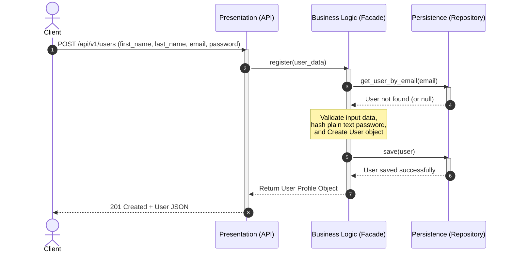
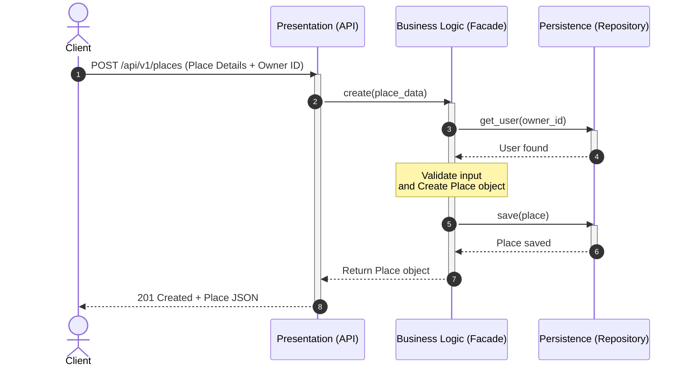
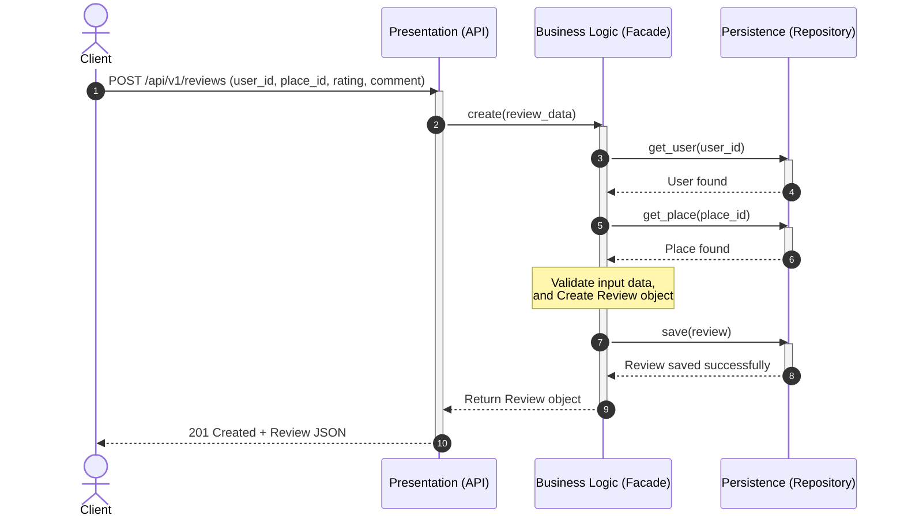
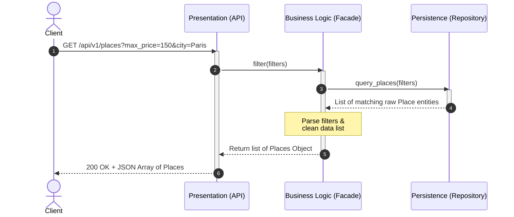

# HBnB Project Technical Design Document

## 1. Introduction

This document provides the technical blueprint for the HBnB project. It shows the system architecture, domain models, and API sequence flows to guide the upcoming implementation phase.

---

## 2. High-Level Architecture

The HBnB project follows a three-layer architecture to isolate responsibilities and decouple user interactions from database operations. A Facade pattern acts as the single point of entry into the business logic layer, simplifying how the presentation layer interacts with internal domain components.

### Explanatory Notes

* **Presentation Layer:** Manages incoming HTTP requests, validates syntax, and serializes output data into JSON format.
* **Business Logic Layer:** Implements core functionality, validates operations, and evaluates entity rules. It utilizes the Facade pattern so that the Presentation layer remains unaware of data storage processes or deep object-to-object relationships.
* **Persistence Layer:** Manages database reads, writes, and connection configurations using individual resource repositories.

---

## 3. Business Logic Layer

The class diagram below shows the core entities of the application, their fields, behaviors, and relationships. It uses inheritance from a central `BaseModel` for shared tracking attributes, and handles roles and ratings strictly through enumerations.

### Explanatory Notes

* **BaseModel Class:** Centralizes tracking fields (`ID`, `created_at`, `updated_at`) so all primary entities share uniform identifiers and lifecycle timestamps automatically.
* **User and Place Relationship:** A direct 1-to-many relationship defines property ownership.
* **Enumerators (UserRole & RatingValue):** Protects data integrity by restricting values to predefined options. Users must match a valid system permission (`OWNER`, `CLIENT`, or `BOTH`), and reviews are restricted to numerical scores from 1 to 5.

---

## 4. API Interaction Flow

The following sequence diagrams trace the step-by-step lifecycle of requests moving across the system architecture layers.

### User Registration:

This flow details how a user creates a new account, including email validation, and role assignment via the system facade.
The client initiates the process by sending new profile data to the API presentation endpoints.
The business facade checks the repository to verify that the provided email address is unique and available.
Once validated, the facade hashes the password, creates the domain object, and commits the records to database storage.

---

### Flow 2: Place Creation

This flow shows how property parameters are processed and validated against existing users before a listing is saved.
The client submits new property listing fields alongside a specific owner identifier to the presentation layer.
The business facade queries the repository to ensure that the referenced owner exists and is authorized to create a listing.
After passing attribute validations, the system instantiates the property object and stores it in the database.

---

### Flow 3: Review Submission

This flow illustrates the verification process checking that both the author and the target property exist before creating a link between them.
The client sends feedback data consisting of a comment text, numerical score, user ID, and target property ID.
The business facade acts as a guard by checking the database to guarantee both the author and the place are valid.
When both references are verified, the review object is created, linked to both entities, and saved.

---

### Flow 4: Fetching a List of Places

This flow shows data retrieval, showing how raw database contents are gathered and packaged.
The client makes an HTTP request to browse listings using optional parameters like maximum price or city filters.
The presentation layer forwards these arguments to the facade, which routes the specific query parameters to the repository.
The repository returns the matching domain models, which the facade cleans and serializes into an array format for the client.

