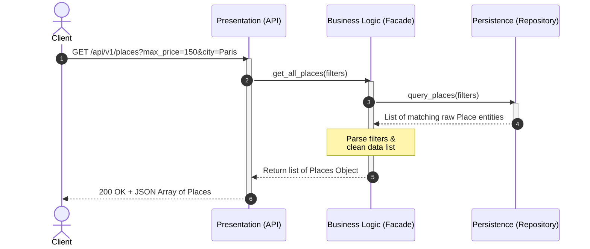

```mermaid
sequenceDiagram
    actor Client
    participant API as Presentation (API)
    participant Facade as Business Logic (Facade)
    participant Repo as Persistence (Repository)

    autonumber

    Client->>API: GET /api/v1/places?max_price=150&city=Paris
    activate API

    API->>Facade: get_all_places(filters)
    activate Facade

    Facade->>Repo: query_places(filters)
    activate Repo
    Repo-->>Facade: List of matching raw Place entities
    deactivate Repo

    Note over Facade: Parse filters &<br/>clean data list

    Facade-->>API: Return list of Places Object
    deactivate Facade

    API-->>Client: 200 OK + JSON Array of Places
    deactivate API
```
```
```
