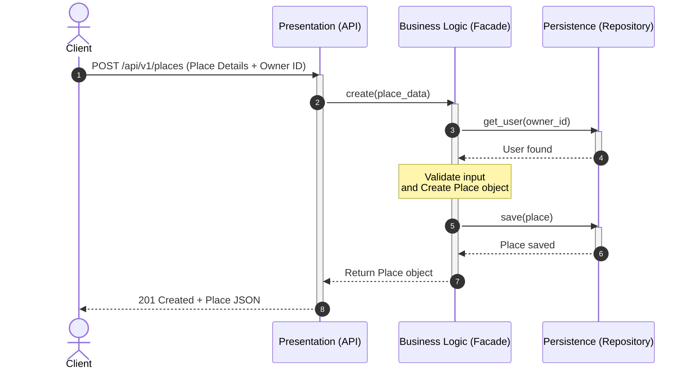

```mermaid
sequenceDiagram
    actor Client
    participant API as Presentation (API)
    participant Facade as Business Logic (Facade)
    participant Repo as Persistence (Repository)

    autonumber

    Client->>API: POST /api/v1/places (Place Details + Owner ID)
    activate API

    API->>Facade: create(place_data)
    activate Facade

    Facade->>Repo: get_user(owner_id)
    activate Repo
    Repo-->>Facade: User found
    deactivate Repo

    Note over Facade: Validate input<br/>and Create Place object

    Facade->>Repo: save(place)
    activate Repo
    Repo-->>Facade: Place saved
    deactivate Repo

    Facade-->>API: Return Place object
    deactivate Facade

    API-->>Client: 201 Created + Place JSON
    deactivate API
```
```
```
