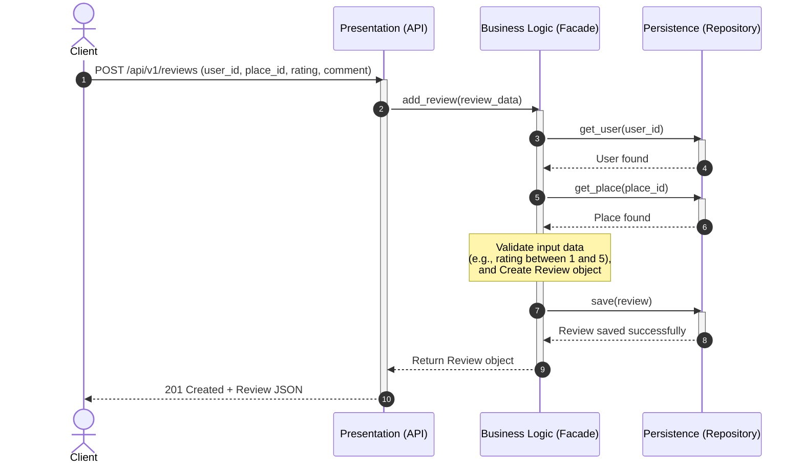

```mermaid
sequenceDiagram
    actor Client
    participant API as Presentation (API)
    participant Facade as Business Logic (Facade)
    participant Repo as Persistence (Repository)

    autonumber

    Client->>API: POST /api/v1/reviews (user_id, place_id, rating, comment)
    activate API

    API->>Facade: add_review(review_data)
    activate Facade

    Facade->>Repo: get_user(user_id)
    activate Repo
    Repo-->>Facade: User found
    deactivate Repo

    Facade->>Repo: get_place(place_id)
    activate Repo
    Repo-->>Facade: Place found
    deactivate Repo

    Note over Facade: Validate input data<br/>(e.g., rating between 1 and 5),<br/>and Create Review object

    Facade->>Repo: save(review)
    activate Repo
    Repo-->>Facade: Review saved successfully
    deactivate Repo

    Facade-->>API: Return Review object
    deactivate Facade

    API-->>Client: 201 Created + Review JSON
    deactivate API
```
```
```
