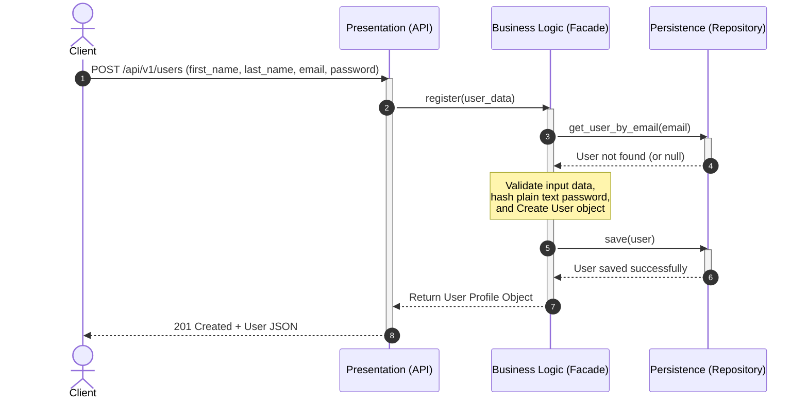

```mermaid
sequenceDiagram
    actor Client
    participant API as Presentation (API)
    participant Facade as Business Logic (Facade)
    participant Repo as Persistence (Repository)

    autonumber

    Client->>API: POST /api/v1/users (first_name, last_name, email, password)
    activate API

    API->>Facade: register(user_data)
    activate Facade

    Facade->>Repo: get_user_by_email(email)
    activate Repo
    Repo-->>Facade: User not found (or null)
    deactivate Repo

    Note over Facade: Validate input data,<br/>hash plain text password,<br/>and Create User object

    Facade->>Repo: save(user)
    activate Repo
    Repo-->>Facade: User saved successfully
    deactivate Repo

    Facade-->>API: Return User Profile Object
    deactivate Facade

    API-->>Client: 201 Created + User JSON
    deactivate API
```
